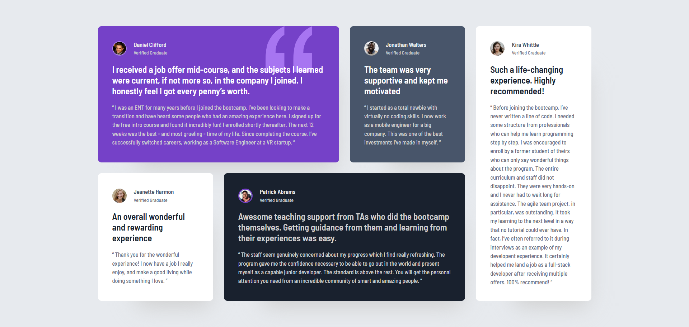
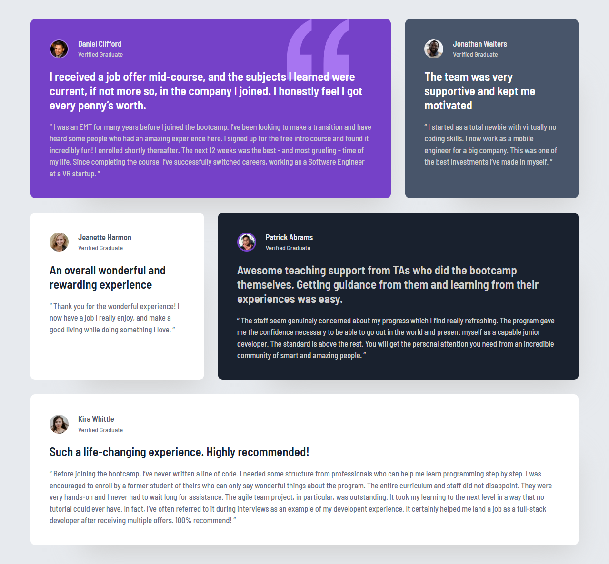
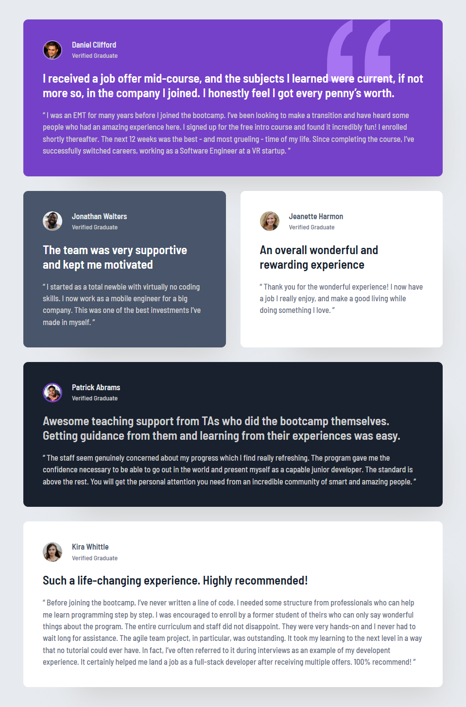
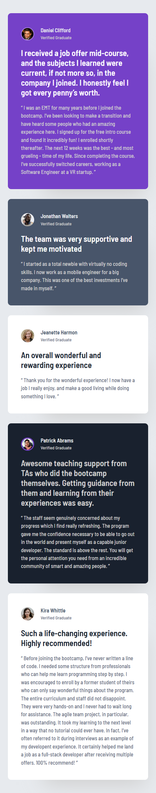

# Frontend Mentor - Testimonials grid section solution

This is a solution to the [Testimonials grid section challenge on Frontend Mentor](https://www.frontendmentor.io/challenges/testimonials-grid-section-Nnw6J7Un7). Frontend Mentor challenges help you improve your coding skills by building realistic projects. 

## Table of contents

- [Overview](#overview)
  - [The challenge](#the-challenge)
  - [Screenshots](#screenshots)
  - [Links](#links)
- [My process](#my-process)
  - [Built with](#built-with)
  - [What I learned](#what-i-learned)
- [Acknowledgments](#acknowledgments)

## Overview

### The challenge

Users should be able to:

- View the optimal layout for the site depending on their device's screen size

### Screenshots

<table>
  <tr>
    <th style="text-align: center">Desktop Design</th>
  </tr>
  <tr>
    <td></td>
  </tr>
</table>

<table>
  <tr>
    <th style="text-align: center">Tablet (Larger) Design</th>
    <th style="text-align: center">Tablet (Smaller) Design</th>
  </tr>
  <tr>
    <td></td>
    <td></td>
  </tr>
</table> 

  <table>
    <tr>
      <th style="text-align: center">Mobile Design</th>
    </tr>
    <tr>
      <td></td>
    </tr>
  </table>

### Links

- Solution URL: https://github.com/Dorm-24/Testimonials-grid-section-main
- Live Site URL: https://dorm-24.github.io/Testimonials-grid-section-main

## My process

### Built with

- Semantic HTML5 markup
- CSS custom properties
- CSS Flexbox
- CSS Grid
- Mobile-first workflow

### What I learned

I learned how to make a website look well on different screen sizes using CSS Grid and Flexbox. I also practiced using simple HTML5 and CSS custom properties, which made my code easier to change. This project helped me understand how to start with mobile design first and why accessibility is important.

## Acknowledgments

For this project, I was inspired by [Kevin Powell](https://www.youtube.com/@KevinPowell). His solution has helped me with implementing multiple breakpoints, overcoming design challenges, and more.
